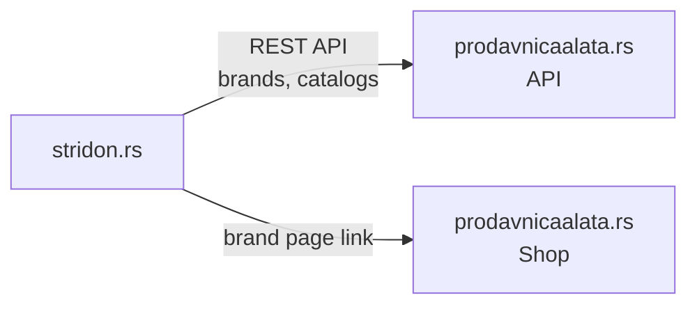

# Stridon Group (stridon.rs)

Site of Stridon Group DOO, the parent company behind the SG TOOLS brand, the only verified DCK supplier in Serbia, and the prodavnicaalata.rs shop. Serbian with an English version at `/en`.

## Tech Stack

- **Next.js 16** (App Router) + TypeScript, `cacheComponents`
- **next-intl** (Serbian default, English under `/en`)
- **Tailwind CSS v4** with OKLCH color tokens
- **Deployed on Vercel**

## Architecture



Brands (every PACMS brand with an `orderNumber`, in that order) and catalogs are read server-side from the prodavnicaalata.rs REST API. There are no product pages: each brand page links to that brand on prodavnicaalata.rs, and this site has no cart or checkout.

## Getting Started

From the repo root:

```bash
pnpm dev:stridon                          # dev server (localhost:3000)
pnpm -C apps/stridon exec tsc --noEmit    # type-check
pnpm -C apps/stridon test                 # unit tests
pnpm --filter stridon-storefront build    # production build
```

## Domain Map

| Domain                 | Purpose                                     |
| ---------------------- | ------------------------------------------- |
| **stridon.rs**         | This project - Stridon Group parent company |
| **sgtools.rs**         | SG TOOLS brand site                         |
| **dcksrbija.rs**       | DCK brand site                              |
| **prodavnicaalata.rs** | Online shop - where users buy products      |
